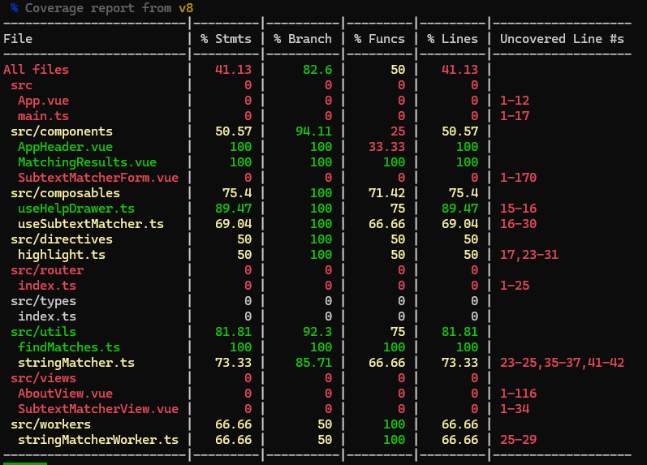

# Subtext Matcher SPA

A modern, accessible, and performant string matching application built with Vue 3, TypeScript, and PrimeVue.

- **Live Demo:** [https://wonderful-hill-05781f610-1.centralus.2.azurestaticapps.net/](https://wonderful-hill-05781f610-1.centralus.2.azurestaticapps.net/)

## Features
- Case-insensitive substring matching with starting position indices
- Responsive, mobile-first design
- Accessibility (WCAG 2.1 AA), keyboard navigation, and screen reader support
- Web Worker for non-blocking performance
- Custom animated match highlighting
- Clean, modular codebase with high test coverage




## Getting Started

### Prerequisites
- Node.js v22 or higher
- npm (comes with Node.js)

### Install dependencies
```sh
npm install
```

### Run the app locally (development mode)
```sh
npm run dev
```

### Build for production
```sh
npm run build
```

### Preview production build locally
```sh
npm run preview
```

## Linting
Run ESLint to check and fix code style issues:
```sh
npm run lint:check   # Check for lint errors
npm run lint:fix     # Fix lint errors automatically
```

## Testing
Run all unit and integration tests:
```sh
npm test             # Run all tests
npm run test:ui      # Run tests in interactive UI mode
npm run test:coverage # Run tests with coverage report
```

## Project Structure
- `src/` — Main source code
  - `components/` — Reusable UI components
  - `composables/` — Reusable logic (Vue Composition API)
  - `directives/` — Custom Vue directives
  - `router/` — Vue Router configuration
  - `utils/` — Pure helper functions
  - `views/` — Top-level route components
  - `workers/` — Web Worker scripts
  - `assets/` — Images and global styles
- `public/` — Static assets
- `__tests__/` — Unit and integration tests
- `coverage/` — Test coverage reports

## License
MIT
